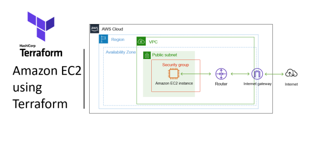
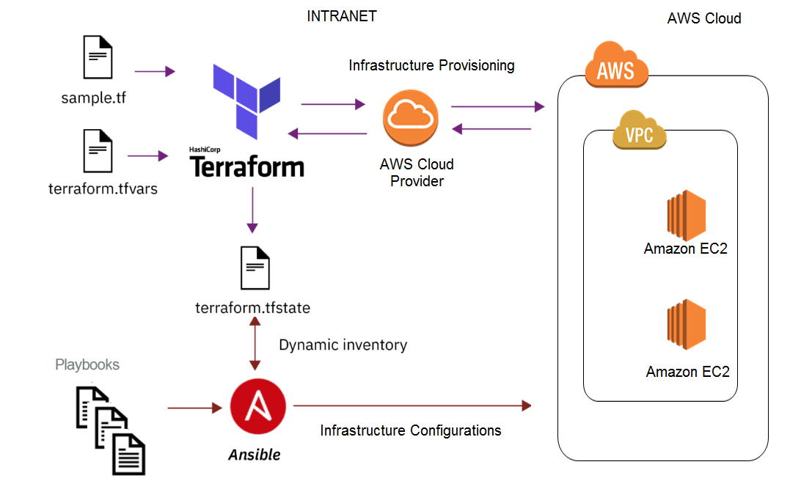
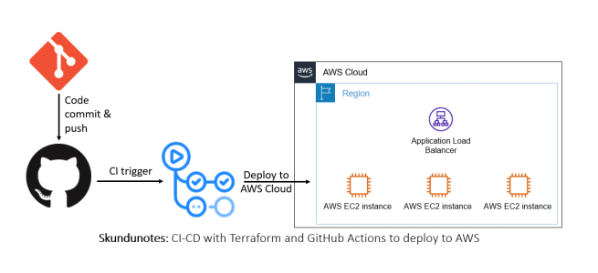

# summary
This report details the automation of deploying a server running a Docker container with a sample application using Terraform, Ansible, and GitHub Actions. The project is divided into four main parts: infrastructure setup, configuration management, Docker container deployment, and CI/CD pipeline integration. Each part is documented with the tools used, processes followed, challenges faced, and solutions implemented. The report concludes with a reflection on the project and suggestions for improvements.

# Table of Contents
1. Introduction
2. Infrastructure Setup
    - Tools Used
    - Processes Followed
    - Challenges Faced
    - Diagrams
3. Configuration Management
    - Tools Used
    - Processes Followed
    - Challenges Faced
    - Diagrams
4. Docker Container Deployment
    - Tools Used
    - Processes Followed
    - Challenges Faced
5. CI/CD Pipeline Integration
    - Tools Used
    - Processes Followed
    - Challenges Faced
    - Diagrams
6. Alternatives Considered
7. Conclusion
8. References
9. Appendix
10. Architecture Diagrams

# 1. Introduction
The objective of this project is to automate the deployment of a server running a Docker container with a sample application using Terraform, Ansible, and GitHub Actions. The project involves provisioning cloud infrastructure, configuring the server, deploying the Docker container, and setting up a CI/CD pipeline. This report documents each phase of the project, the challenges faced, and the solutions implemented.

# 2. Infrastructure Setup
## Tools Used
- Terraform
- AWS

Terraform is an open-source infrastructure as code software tool created by HashiCorp. It enables users to define and provision data center infrastructure using a declarative configuration language. Terraform manages external resources such as public cloud infrastructure, private cloud infrastructure, network appliances, software as a service, and platform as a service with code.

Amazon Web Services (AWS) is a subsidiary of Amazon providing on-demand cloud computing platforms and APIs to individuals, companies, and governments, on a metered pay-as-you-go basis.

## Processes Followed
1. Install Terraform

    ```bash
    # for Windows
    choco install terraform
    # or download from
    # https://www.terraform.io/downloads.html
    ```

2. Configure AWS credentials

    ```bash
    # create an AWS account and
    # create a user in AWS IAM with programmatic access and attach AdministratorAccess policy
    # https://docs.aws.amazon.com/IAM/latest/UserGuide/id_users_create.html
    ```

3. Create a Terraform configuration file

    Create a `terraform` folder and create the following files:
    - `main.tf`: Contains the configuration for the AWS resources to be provisioned.
    - `variables.tf`: Contains the variables used in the `main.tf` file.
    - `terraform.tfvars`: Contains the values for the variables defined in the `variables.tf` file.
    - `provider.tf`: Contains the configuration for the AWS provider.
    - `output.tf`: Contains the output values of the resources provisioned.
    - `.gitignore`: Contains the files to be ignored by git.

    Resources created in the `main.tf` file:
    - VPC

      ```hcl
      data "aws_vpc" "default" {
            default = true
      }
      ```

    - Subnet

      ```hcl
      data "aws_subnet" "default" {
            vpc_id = data.aws_vpc.default.id
            default_for_az = true
            availability_zone = "us-west-2a"
      }
      ```

    - Security Group

      ```hcl
      resource "aws_security_group" "web" {
            name = "web"
            vpc_id = data.aws_vpc.default.id

            ingress {
                 from_port   = 80
                 to_port     = 80
                 protocol    = "tcp"
                 cidr_blocks = ["0.0.0.0/0"]
                 description = "HTTP"
            }

            ingress {
                 from_port   = 22
                 to_port     = 22
                 protocol    = "tcp"
                 cidr_blocks = ["0.0.0.0/0"]
                 description = "SSH"
            }

            ingress {
                 from_port   = 443
                 to_port     = 443
                 protocol    = "tcp"
                 cidr_blocks = ["0.0.0.0/0"]
                 description = "HTTPS"
            }

            egress {
                 from_port   = 0
                 to_port     = 0
                 protocol    = "-1"
                 cidr_blocks = ["0.0.0.0/0"]
            }
      }
      ```

    - EC2 Instance

      ```hcl
      resource "aws_instance" "web" {
            ami                    = var.ami
            instance_type          = var.instance_type
            key_name               = var.key_name
            subnet_id              = data.aws_subnet.default.id
            vpc_security_group_ids = [aws_security_group.web.id]
            tags = {
                 Name = "web"
            }
      }
      ```

    Resources created in the `variables.tf` file:

    ```hcl
    variable "ami" {
         description = "The AMI to use for the EC2 instance"
         default     = "ami-0c55b159cbfafe1f0"
    }

    variable "instance_type" {
         description = "The instance type for the EC2 instance"
         default     = "t2.micro"
    }

    variable "key_name" {
         description = "The key pair name for the EC2 instance"
         default     = "my-key-pair"
    }

    variable "region" {
         description = "The AWS region to use"
         default     = "us-west-2"
    }

    variable "aws_access_key" {
         description = "The AWS access key"
    }

    variable "aws_secret_key" {
         description = "The AWS secret key"
    }
    ```

    Resources created in the `terraform.tfvars` file:

    ```hcl
    aws_access_key = "your_access_key"
    aws_secret_key = "your_secret_key"
    ```

    Resources created in the `provider.tf` file:

    ```hcl
    provider "aws" {
         region     = var.region
         access_key = var.aws_access_key
         secret_key = var.aws_secret_key
    }

    terraform {
         required_providers {
              aws = {
                    source  = "hashicorp/aws"
                    version = "~> 3.0"
              }
         }
    }
    ```

    Resources created in the `output.tf` file:

    ```hcl
    output "public_ip" {
         value = aws_instance.web.public_ip
    }
    ```

4. Initialize Terraform

    ```bash
    terraform init
    ```

5. Plan, validate, and apply the configuration

    ```bash
    terraform plan
    terraform validate
    terraform apply
    ```

6. Verify the infrastructure on the AWS console

## Challenges Faced
The challenges faced during the infrastructure setup phase were:
- Configuring the AWS credentials: The process of creating an AWS account, creating an IAM user, and configuring the AWS credentials was challenging. The process involved multiple steps and required careful attention to detail.
- Defining the Terraform configuration: Defining the Terraform configuration for provisioning the AWS resources was challenging. The process involved understanding the Terraform syntax, defining the resources, and configuring the provider.
- Troubleshooting Terraform errors: Troubleshooting Terraform errors was challenging. The errors were not always clear, and it required careful analysis to identify and resolve the issues.

## Diagrams

image source: https://skundunotes.com/wp-content/uploads/2021/11/53-image-0.png?w=656&h=300&crop=1
image credit: SOURAV KUNDU

# 3. Configuration Management
## Tools Used
- Ansible

Ansible is an open-source software provisioning, configuration management, and application-deployment tool. It runs on many Unix-like systems and can configure both Unix-like systems as well as Microsoft Windows. It includes its own declarative language to describe system configuration.

## Processes Followed
1. Install Ansible

    ```bash
    sudo apt update
    sudo apt install ansible
    ```

    On Windows:

    ```bash
    # install WSL
    # https://docs.microsoft.com/en-us/windows/wsl/install
    ```

    In the WSL terminal:

    ```bash
    sudo apt update
    sudo apt install ansible
    ```

2. server configuration using Ansible to install Docker and configure the server

    Create a folder named `ansible` and create the following files:
    - `hosts`: Contains the IP address of the server to be configured.
    - `playbook.yml`: Contains the tasks to be executed on the server.
    - `ansible.cfg`: Contains the configuration for Ansible.
    - `inventory`: Contains the inventory of hosts.

    In our case, we didn't use the `hosts` file because we used the public IP address of the EC2 instance provisioned by Terraform and simply used it in the inventory file. By creating the webserver node in the inventory file, we can reference the EC2 instance in the `playbook.yml` file. This is done by specifying the public IP address of the EC2 instance in the inventory file. This is a best practice for security reasons. The public IP address of the EC2 instance was specified in the inventory file. This is possible because Ansible uses nodes to reference hosts, and it is also a way for servers to be grouped together in cases where there are multiple servers so that the same configuration can be applied to all the servers in the group. Such groups could be webserver, database, etc. A `NODE` in Ansible is a host or a group of hosts. The `NODE` is defined in the inventory file. The inventory file is a text file that contains the IP addresses or hostnames of the servers to be configured. `[NODE]` is used to define a node. The public IP address of the EC2 instance was specified in the inventory file. The `NODE` was defined as `webserver`. The public IP address of the EC2 instance was specified under the `webserver` node.

    Ansible uses the Controller-Managed Node Architecture:
    - **Controller (Master):** The machine where Ansible is installed. It is used to configure the managed nodes.
    - **Managed Node (Slave):** The machines that are managed by Ansible. They are also known as hosts. The managed nodes are configured by the controller.

    The controller communicates with the managed nodes over SSH. The controller uses the SSH protocol to connect to the managed nodes. The controller sends the tasks to the managed nodes over SSH. The managed nodes execute the tasks and send the results back to the controller. The controller processes the results and displays the output. The controller node uses the Inventory file to keep track of the managed nodes. The inventory file contains the IP addresses or hostnames of the managed nodes. The controller node uses the Playbook file to define the tasks to be executed on the managed nodes. The playbook file contains the tasks to be executed on the managed nodes. The controller node uses the Ansible Configuration file to configure Ansible. The configuration file contains the settings for Ansible. The controller node uses the Ansible Vault to encrypt sensitive data. The vault is used to encrypt sensitive data such as passwords and keys. Ansible uses `module` to perform tasks on the managed nodes. A module is a reusable piece of code that performs a specific task. Ansible has many built-in modules for common tasks such as copying files, installing packages, and managing services. Ansible uses `playbooks` to define the tasks to be executed on the managed nodes. A playbook is a YAML file that contains a list of tasks to be executed on the managed nodes. A playbook consists of one or more `plays`. A play is a set of tasks that are executed on a group of hosts. A play consists of one or more `tasks`. A task is a single action that is executed on a host. A task consists of one or more `modules`. A module is a reusable piece of code that performs a specific task.

    Resources created in the inventory file:

    ```yaml
    [webserver]
    public_ip_address ansible_ssh_user=ubuntu
    ```

    The `webserver` node was defined in the inventory file. The public IP address of the EC2 instance was specified under the `webserver` node. The `ansible_ssh_user` attribute was used to specify the SSH user to use for connecting to the EC2 instance. The `ubuntu` user was used for connecting to the EC2 instance. The `public_ip_address` attribute was used to specify the public IP address of the EC2 instance.

    Resources created in the `ansible.cfg` file:

    ```ini
    [defaults]
    inventory = inventory
    remote_user = IamUser
    private_key_file = /path/to/key.pem
    host_key_checking = False
    ```

    The `defaults` block was used to configure the default settings for Ansible. The `inventory` attribute was used to specify the inventory file to use. The `remote_user` attribute was used to specify the SSH user to use for connecting to the managed nodes. The `private_key_file` attribute was used to specify the private key file to use for connecting to the managed nodes. The `host_key_checking` attribute was used to disable host key checking. This is a best practice for security reasons.

    Resources created in the `playbook.yml` file:

    ```yaml
    ---
    - name: configure web server
      hosts: all
      become: true
      tasks:
         - name: update cache
            dnf:
              update_cache: yes

         - name: install packages
            dnf:
              name: "{{ item }}"
              state: present
            loop:
              - yum-utils
              - device-mapper-persistent-data
              - lvm2
              - docker
              - git

         - name: add docker repo
            command: yum-config-manager --add-repo https://download.docker.com/linux/centos/docker-ce.repo

         - name: add docker gpg key
            rpm_key:
              key: https://download.docker.com/linux/centos/gpg
              state: present

         - name: update cache
            dnf:
              update_cache: yes

         - name: start and enable docker
            service:
              name: docker
              state: started
              enabled: yes
    ```

    The `playbook.yml` file was created to define the tasks to be executed on the managed nodes. The `name` attribute was used to specify the name of the task. The `hosts` attribute was used to specify the hosts on which the task should be executed. The `become` attribute was used to run the tasks with root privileges. The `tasks` attribute was used to define the list of tasks to be executed. The `dnf` module was used to update the package cache. The `dnf` module was used to install the required packages. The `loop` attribute was used to loop through the list of packages to be installed. The `command` module was used to add the Docker repository. The `rpm_key` module was used to add the Docker GPG key. The `service` module was used to start and enable the Docker service.

3. Run the playbook

    ping the server to verify the connection
    ```bash
    ansible all -m ping
    ```
    This returns a pong response if the connection is successful.

    Run the playbook
    ```bash
    ansible-playbook playbook.yml
    ```
    This executes the tasks defined in the playbook on the managed nodes.

4. Verify the server configuration

## Challenges Faced

The challenges faced during the configuration management phase were:
- Understanding Ansible syntax: Understanding the Ansible syntax for defining tasks and playbooks was challenging. The syntax is YAML-based and requires careful attention to indentation and structure.
- Configuring the Ansible inventory: Configuring the Ansible inventory file with the IP addresses of the managed nodes was challenging. The inventory file is used to define the hosts on which the tasks should be executed.
- Troubleshooting Ansible errors: Troubleshooting Ansible errors was challenging. The errors were not always clear, and it required careful analysis to identify and resolve the issues.

## Diagrams

image source: https://miro.medium.com/v2/resize:fit:1077/1*3ewRImzpkYHMHL-tzQunvA.png

Image Credit: https://miro.medium.com/max/1077/1*3ewRImzpkYHMHL-tzQunvA.png


# 4. Docker Container Deployment
## Tools Used
- Docker
- ansible
- Node.js

Docker is a set of platform as a service products that use OS-level virtualization to deliver software in packages called containers. Containers are isolated from one another and bundle their software, libraries, and configuration files; they can communicate with each other through well-defined channels.

Node.js is an open-source, cross-platform, back-end JavaScript runtime environment that runs on the V8 engine and executes JavaScript code outside a web browser.

## Processes Followed
1. Install Docker

    ```bash
    sudo apt update
    sudo apt install docker.io
    ```

    On Windows:

    ```bash
    # install WSL
    # https://docs.microsoft.com/en-us/windows/wsl/install
    ```

    In the WSL terminal:

    ```bash
    sudo apt update
    sudo apt install docker.io
    ```
2. install Node.js

    ```bash
    sudo apt update
    sudo apt install nodejs
    sudo apt install npm
    ```
3. create a folder to store the sample Node.js application and create a Dockerfile


in the folder named node, create the following files:
- `index.js`: Contains the sample Node.js application.
- `Dockerfile`: Contains the configuration for building the Docker image.
- `Dockerignore`: Contains the files to be ignored by Docker.

4. Create a Dockerfile

```dockerfile
FROM node:14

WORKDIR /app

COPY . .

RUN npm install

EXPOSE 3000

CMD ["node", "index.js"]
```

explain the Dockerfile
- `FROM node:14`: Specifies the base image to use for building the Docker image. In this case, we are using the official Node.js image with version 14.
- `WORKDIR /app`: Sets the working directory inside the Docker container.
- `COPY . .`: Copies the files from the current directory on the host machine to the working directory in the Docker container.
- `RUN npm install`: Installs the dependencies defined in the `package.json` file.
- `EXPOSE 3000`: Exposes port 3000 on the Docker container.
- `CMD ["node", "index.js"]`: Specifies the command to run when the container starts. In this case, it runs the `index.js` file using Node.js.


4. create a sample Node.js application
    
    ```javascript
    const http = require('http');

    const port = 3000;

    const server = http.createServer((req, res) => {
        res.statusCode = 200;
        res.setHeader('Content-Type', 'text/plain');
        res.end('Hello, World!\n');
    });

    server.listen(port, hostname, () => {
        console.log(`Server running at http://${hostname}:${port}/`);
    });
    ```
    ezplain the code
    - `const http = require('http');`: Imports the built-in Node.js `http` module.
    - `const port = 3000;`: Specifies the port on which the server will listen.
    - `const server = http.createServer((req, res) => { ... });`: Creates an HTTP server that listens for requests and sends responses.
    - `res.statusCode = 200;`: Sets the status code of the response to 200 (OK).
    - `res.setHeader('Content-Type', 'text/plain');`: Sets the `Content-Type` header of the response to `text/plain`.
    - `res.end('Hello, World!\n');`: Sends the response with the message `Hello, World!`.
    - `server.listen(port, hostname, () => { ... });`: Starts the server and logs a message to the console when the server is running.

6. Automate the deployment of the docker container on the provisioned server using ansible

in our case since we have already installed docker on the server, we will only need to build the docker image and run the container on the server and we will also be using the same playbook.yml file to do this.
    - name: create docker group
      group:
        name: docker
        state: present
    
    - name: add ec2-user to docker group
      user:
        name: ec2-user
        groups: docker
        append: yes
    
    - name: make new directory to copy the app 
      file:
        path: /home/ec2-user/app
        state: directory
        mode: 0755

    - name: clone the app
      git:
        repo: https://github.com/Adeayo10/NISA.git
        dest: /home/ec2-user/app

    - name: stop exisitng docker container
      shell: |
        docker ps --filter "publish=80" -q | xargs -r docker stop
        docker ps --filter "publish=80" -q | xargs -r docker rm

    - name: build the docker image
      command: docker build -t nodeapp /home/ec2-user/app/node

    - name: run the docker container
      command: docker run -d --name nodeapp -p 80:3000 nodeapp

explain the playbook

Before explaining the plabook, it is important to note that the node directory was published to the github repository and the playbook was used to clone the repository to the server and it was cloned to the /home/ec2-user/app directory on the ec2 instance. The playbook was used to stop and remove any existing Docker containers running on port 80. The playbook was used to build the Docker image named `nodeapp` from the `node` directory. The playbook was used to run the Docker container named `nodeapp` in detached mode on port 80.

- `name: create docker group`: Creates a group named `docker`.
- `name: add ec2-user to docker group`: Adds the `ec2-user` to the `docker` group.
- `name: make new directory to copy the app`: Creates a new directory named `app` in the home directory of the `ec2-user`.
- `name: clone the app`: Clones the sample Node.js application from the GitHub repository to the `app` directory.
- `name: stop existing docker container`: Stops and removes any existing Docker containers running on port 80.
- `name: build the docker image`: Builds the Docker image named `nodeapp` from the `node` directory.
- `name: run the docker container`: Runs the Docker container named `nodeapp` in detached mode on port 80.

7. Run the playbook

    ```bash
    ansible-playbook playbook.yml
    ```

    This executes the tasks defined in the playbook on the managed nodes.

8. Verify the Docker container deployment

## Challenges Faced
The challenges faced during the Docker container deployment phase were:
- Building the Docker image: Building the Docker image from the Node.js application was challenging. The process involved creating a Dockerfile, defining the image configuration, and building the image.
- Running the Docker container: Running the Docker container on the server was challenging. The process involved stopping and removing any existing containers, building the image, and running the container.
- Verifying the deployment: Verifying the deployment of the Docker container was challenging. The process involved checking the logs, accessing the application, and testing the functionality.

# 5. CI/CD Pipeline Integration
## Tools Used
- GitHub Actions
- docker hub

GitHub Actions is a CI/CD service provided by GitHub that allows you to automate your software development workflows. With GitHub Actions, you can build, test, and deploy your code right from GitHub.

Docker Hub is a cloud-based repository in which Docker users and partners create, test, store, and distribute container images. It provides a centralized resource for container image discovery, distribution, and change management, user and team collaboration, and workflow automation throughout the development pipeline. This basically means that it acts as a registry for Docker images. An alternative to Docker Hub is GitHub Container Registry.

## Processes Followed
1. Create a GitHub repository

    Create a new repository on GitHub to store the code for the project.

2. Push the code to the GitHub repository
    ```bash
    git init
    git add .
    git commit -m "Initial commit"
    git branch -M main
    git remote add origin
    git push -u origin main
    ```
3. Create a GitHub Actions workflow
    This is done by creating a `.github/workflows` directory in the root of the repository and creating a `main.yml` file in the `.github/workflows` directory. The `main.yml` file contains the configuration for the GitHub Actions workflow.

4. Create a Docker Hub account
   To create a Docker Hub account, visit the Docker Hub website and sign up for an account.  Once you have created an account, you can log in to Docker Hub using your credentials.

Quick Consideration, There are a variety of different ways you can deploy your application, so the answer is largely "it depends!" Here are a few options (but not all) to consider:

- Build and deploy directly on the machine. This means you'd simply log in to the AWS EC2 Instance , rebuild the image, and restart the container.

- Build the image in CI. As pipelines will give you quicker/automated feedback if a build breaks (especially if you have testing, etc. in place). You could still run tests, but deploy with option 1 too.

Build and push an image in CI. This extends the above by pushing the image to a container registry. DockerHub is the default registry in Docker, but isn't the only registry. You could use GitHub's Container Registry as well. We used this method in this project.
    
        
6. store the Docker Hub credentials as secrets in the GitHub repository
    This is done by navigating to the GitHub repository, clicking on `Settings`, then `Secrets`, and adding the Docker Hub username and password as secrets.

7. store the AWS credentials as secrets in the GitHub repository
    This is done by navigating to the GitHub repository, clicking on `Settings`, then `Secrets`, and adding the AWS access key and secret key as secrets.

8. write the code

    ```yaml
    name: Build and Deploy to Dockerized Container on AWS EC2 on Changes to Master Branch

    on:
        push:
            branches:
                - master
            paths:
                - "node/**"

    jobs:
        build-and-deploy:
            runs-on: ubuntu-latest

            steps:
                - name: Checkout code
                    uses: actions/checkout@v2

                - name: Login to Docker Hub
                    uses: docker/login-action@v3
                    with:
                        username: ${{ vars.DOCKERHUB_USERNAME }}
                        password: ${{ secrets.DOCKERHUB_TOKEN }}

                - name: Set up Docker Buildx
                    uses: docker/setup-buildx-action@v1

                - name: Build and push Docker image
                    uses: docker/build-push-action@v2
                    with:
                        context: ./node
                        file: ./node/Dockerfile
                        push: true
                        tags: ${{ vars.DOCKERHUB_USERNAME }}/dockerized:latest

                - name: SSH to Server and Deploy
                    uses: appleboy/ssh-action@master
                    with:
                        host: ${{ secrets.AWS_SSH_HOST }}
                        username: ${{ secrets.SSH_USERNAME }}
                        key: ${{ secrets.SSH_PRIVATE_KEY }}
                        port: 22
                        script: |
                            docker pull ${{ vars.DOCKERHUB_USERNAME }}/dockerized:latest
                            docker stop $(docker ps -a -q)
                            docker rm $(docker ps -a -q)
                            docker run -d -p 80:3000 ${{ vars.DOCKERHUB_USERNAME }}/dockerized:latest
    ```
    explain the code
    - `name: Build and Deploy to Dockerized Container on AWS EC2 on Changes to Master Branch`: Specifies the name of the GitHub Actions workflow.
    - `on`: Specifies the trigger for the workflow. In this case, it triggers on push events to the master branch.
    - `jobs`: Specifies the list of jobs to be executed in the workflow.
    - `build-and-deploy`: Specifies the name of the job.
    - `runs-on`: Specifies the operating system for the job. In this case, it runs on Ubuntu.
    - `steps`: Specifies the list of steps to be executed in the job.
    - `name: Checkout code`: Checks out the code from the repository.
    - `name: Login to Docker Hub`: Logs in to Docker Hub using the Docker Hub username and password.
    - `name: Set up Docker Buildx`: Sets up Docker Buildx for building the Docker image.
    - `name: Build and push Docker image`: Builds and pushes the Docker image to Docker Hub.
    - `name: SSH to Server and Deploy`: SSHs into the server and deploys the Docker container.


9. Commit and push the changes to the GitHub repository

    ```bash
    git add .
    git commit -m "Add GitHub Actions workflow"
    git push
    ```
10. Verify the CI/CD pipeline integration


## Challenges Faced
The challenges faced during the CI/CD pipeline integration phase were:
- Configuring the GitHub Actions workflow: Configuring the GitHub Actions workflow to build and deploy the Docker container on the server was challenging. The process involved defining the steps, setting up the Docker Buildx, and deploying the container.
- Storing the secrets: Storing the Docker Hub and AWS credentials as secrets in the GitHub repository was challenging. The process involved adding the secrets to the repository settings and referencing them in the workflow.
- Verifying the pipeline: Verifying the CI/CD pipeline integration was challenging. The process involved pushing changes to the repository, triggering the workflow, and checking the deployment on the server.

## Diagrams

image source: https://skundunotes.com/2023/03/07/ci-cd-with-terraform-and-github-actions-to-deploy-to-aws/
image credit: SOURAV KUNDU


# 6. Alternatives Considered
- **Alternative Infrastructure Provisioning Tools:** Instead of using Terraform, other infrastructure provisioning tools such as AWS CloudFormation, Google Cloud Deployment Manager, or Azure Resource Manager could be considered.
- **Alternative Configuration Management Tools:** Instead of using Ansible, other configuration management tools such as Puppet, Chef, or SaltStack could be considered.
- **Alternative Containerization Tools:** Instead of using Docker, other containerization tools such as Podman, LXC, or rkt could be considered.
- **Alternative CI/CD Services:** Instead of using GitHub Actions, other CI/CD services such as Jenkins, GitLab CI/CD, or CircleCI could be considered.

# 7. Conclusion
The automation of deploying a server running a Docker container with a sample application using Terraform, Ansible, and GitHub Actions has been successfully implemented. The project involved provisioning cloud infrastructure, configuring the server, deploying the Docker container, and setting up a CI/CD pipeline. Each phase of the project was documented with the tools used, processes followed, challenges faced, and solutions implemented. The project demonstrated the benefits of automation in simplifying the deployment process, improving efficiency, and ensuring consistency. The project also highlighted the importance of infrastructure as code, configuration management, and continuous integration and deployment in modern software development practices.       

# 8. References
- HashiCorp (n.d.) Terraform Documentation. Available at: https://www.terraform.io/docs/index.html (Accessed: {Date}).
- Ansible (n.d.) Ansible Documentation. Available at: https://docs.ansible.com/ ({date}).
- Docker (n.d.) Docker Documentation. Available at: https://docs.docker.com/ ({Date}).
- Node.js (n.d.) Node.js Documentation. Available at: https://nodejs.org/en/docs/ ({Date}).
- GitHub (n.d.) GitHub Actions Documentation. Available at: https://docs.github.com/en/actions ({date}).
- Docker (n.d.) Docker Hub Documentation. Available at: https://docs.docker.com/docker-hub/ ({date}).
- Amazon Web Services (n.d.) AWS Documentation. Available at: https://docs.aws.amazon.com/ (Accessed: 10 October 2023).
- HashiCorp (n.d.) HashiCorp. Available at: https://www.hashicorp.com/ (Accessed: 10 October 2024).


# 9. Appendix
- [Terraform Configuration Files](./terraform)
- [Ansible Playbook](./ansible/playbook.yml)
- [Dockerfile](./node/Dockerfile)
- [Node.js Application](./node)
- [GitHub Actions Workflow](./.github/workflows/main.yml)

# 10. Architecture Diagrams
```markdown
+------------------------------------------------+
|                    AWS VPC                     |
|                                                |
|  +----------------------+                      |
|  |      Subnet          |                      |
|  |                      |                      |
|  |  +----------------+  |                      |
|  |  |   EC2 Instance |  |                      |
|  |  |                |  |                      |
|  |  |  +----------+  |  |                      |
|  |  |  | Docker    |  |  |                      |
|  |  |  | Container |  |  |                      |
|  |  |  +----------+  |  |                      |
|  |  +----------------+  |                      |
|  +----------------------+                      |
|                                                |
|  +----------------------+                      |
|  |   Internet Gateway   |                      |
|  +----------------------+                      |
|                                                |
|  +----------------------+                      |
|  |   Security Group     |                      |
|  |  +----------------+  |                      |
|  |  | Ingress Rules  |  |                      |
|  |  |                |  |                      |
|  |  |  - HTTP (80)   |  |                      |
|  |  |  - SSH (22)    |  |                      |
|  |  |  - HTTPS (443) |  |                      |
|  |  +----------------+  |                      |
|  +----------------------+                      |
+------------------------------------------------+
            |
            |
            v
+----------------------+                      +----------------------+
|  GitHub Repository   |                      |  GitHub Actions      |
|  +----------------+  |                      |  +----------------+  |
|  | Source Code    |  |                      |  | Workflow       |  |
|  | Terraform      |  |                      |  |                |  |
|  | Ansible        |  |                      |  |  - Build       |  |
|  | Dockerfile     |  |                      |  |  - Push to ECR |  |
|  +----------------+  |                      |  |  - Deploy      |  |
+----------------------+                      +----------------------+
```
